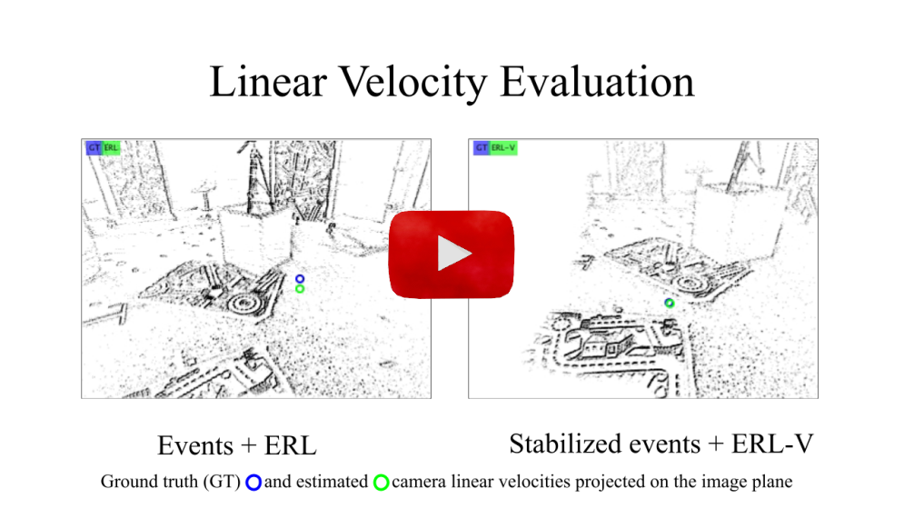

# On the Benefits of Visual Stabilization for Frame- and Event-based Perception

[](https://youtu.be/LAOztE-8FfY)

This is the code for the journal paper [**On the Benefits of Visual Stabilization for Frame- and Event-based Perception**](https://doi.org/10.1109/lra.2024.3450290), by [Juan Pablo Rodríguez-Gómez](https://sites.google.com/view/juanpablorodriguezgomez), [José Ramiro Martínez-de Dios](https://grvc.us.es/jramiromartinezdedios/), [Aníbal Ollero](https://grvc.us.es/newweb/head-of-the-laboratory/), and [Guillermo Gallego](https://sites.google.com/view/guillermogallego), published at IEEE Robotics and Automation Letters.

The [PDF of the paper is available](https://arxiv.org/pdf/2408.15602). If you use this work in your research, please cite it as follows:

```bibtex
@article{Rodriguez24ral,
  author = {Rodríguez-Gómez, J.P. and Dios, J.R. Martínez-de and Ollero, A. and Gallego, G.},  
  title = {On the Benefits of Visual Stabilization for Frame- and Event-based Perception},
  journal = {IEEE Robotics and Automation Letters},
  year = {2024},
  volume={},
  number={},
  pages={1-8},
  doi = {10.1109/LRA.2024.3450290}
}
```

### Input
* Events or frames from a single camera
* Camera orientation from an external source (e.g., motion capture system, IMU, VO)
* Instrinsic camera calibration parameters

### Output
* Stabilized events or frames
* Visualization of stabilized data
* Output dataset in rosbag format

## Code
* [Installation instructions](docs/installation.md)
* [Code](docs/code.md)